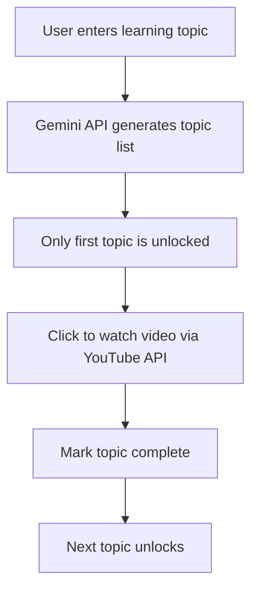

# 🎓 PersonalizEd — A Personalized Learning Platform

**PersonalizEd** is a web-based learning assistant built by **Shivam**, **Janvi**, **Akshat**, and **Shubhra** as part of a **college hackathon project**. It provides a structured, progressive way to learn any topic by combining the power of **Gemini API**, **YouTube API**, and **Firebase Authentication** — all wrapped in a responsive HTML, CSS, and JavaScript frontend.

---

## 📌 Project Description

In a world full of scattered learning resources, **PersonalizEd** helps learners by:

- Asking them *what they want to learn*
- Generating a topic-wise structure using **Gemini API**
- Unlocking topics step-by-step to ensure **sequential learning**
- Providing curated video content using **YouTube API**
- Offering a secure login/signup experience using **Firebase**

> 🔍 **Want to see the demo?**  
> Open the `images` folder in the repo to view all screenshots of the app flow.

---

## ✨ Features

- 🔐 **User Authentication**
  - Firebase-based signup/login
  - Displays user’s name after login
  - Logout functionality

- 🧠 **Personalized Learning Flow**
  - User enters the topic they want to learn
  - Gemini API generates a list of related subtopics

- 🔒 **Topic Locking System**
  - Only the first topic is unlocked initially
  - Subsequent topics unlock only after previous ones are completed

- 🎥 **Video-Based Learning**
  - Clicking on a topic fetches a related learning video via **YouTube API**

- 💻 **Responsive User Interface**
  - Designed using **HTML**, **CSS**, and **Vanilla JavaScript**

---

## 🛠️ Technologies Used

- HTML5, CSS3, JavaScript
- Firebase Authentication
- Gemini API (for topic suggestions)
- YouTube API (for educational video fetch)
- Git & GitHub (version control & collaboration)

---

## 🔄 How It Works



---

## 👥 Contributors

| Name                 | GitHub Profile                            | Core Responsibilities                                                                                         | Collaborated In                                                                 |
|----------------------|--------------------------------------------|----------------------------------------------------------------------------------------------------------------|----------------------------------------------------------------------------------|
| 🛠 **Shivam**              | [@shivamgithub](https://github.com/shivamgithub) *(replace link)*   | - Developed the **Topic Locking System**<br>- Set up the **GitHub repository** and maintained **project structure** | - Assisted Janvi in Firebase logic<br>- Supported Akshat with unlock logic testing |
| 🔐 **Janvi**               | [@janvigit](https://github.com/janvigit) *(replace link)*      | - Built **Login/Signup** using **Firebase Authentication**<br>- Designed the **Home**, **Contact Us**, and **Features** pages | - Worked with Shivam on Firebase integration<br>- Collaborated with Shubhra on layout |
| 📘 **Akshat**              | [@akshatgithub](https://github.com/akshatgithub) *(replace link)*  | - Integrated **Gemini API** to generate topic list<br>- Created flow to display generated topics | - Teamed up with Shivam on unlock testing<br>- Styled results with help from Shubhra |
| 🎬 **Shubhra Varshney**   | [@shubhravarshney]([https://github.com/shubhravarshney](https://github.com/SV2111004)) *(replace link)* | - Integrated **YouTube API** for videos<br>- Designed **feature cards** and key UI components | - Paired with Janvi for visual consistency<br>- Helped Akshat in layout improvements |

---

## 📁 Project Structure

```
├── index.html
├── login.html
├── signup.html
├── script.js
├── style.css
├── /images           ← 📸 Screenshots and demo images
├── /assets           ← Logos, icons, and static content
└── README.md         ← You are here!
```

---

## 📩 Feedback or Suggestions?

Feel free to connect with any contributor via GitHub (links above) or raise an issue in the repository.

---

## 🏁 Project Status

✅ Completed and submitted in college hackathon  
🚀 Open to improvements, contributions, and deployment

---
